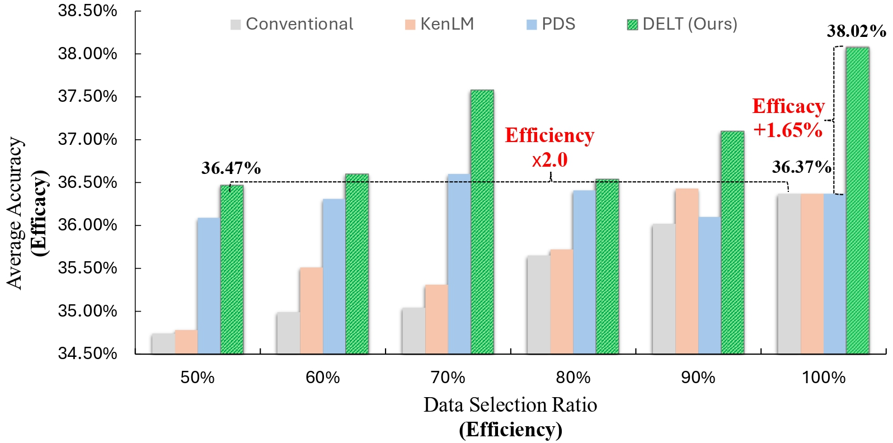
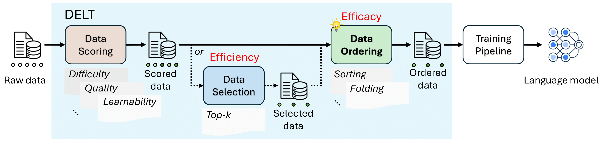
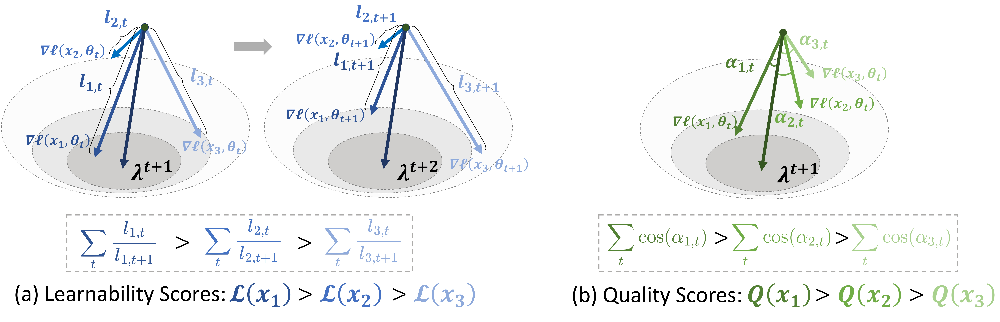
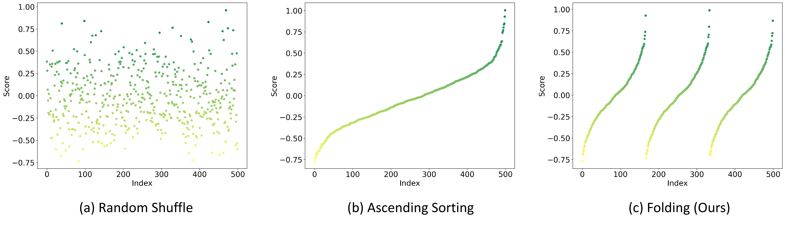

# Data Efficacy for Language Model Training

<p align="center">
 
 
 
</p>

<p align="center">
  <a href="https://arxiv.org/abs/2506.21545"><b>[DELT Paper]</b></a> •
  <a href="https://github.com/microsoft/DELT"><b>[Original Code]</b></a> •
  <a href="https://huggingface.co/microsoft/DELT"><b>[HF Model]</b></a>
</p>

This repository contains the official implementation of "Data Efficacy for Language Model Training" (**DELT**), which studies data efficacy for language model training through three connected stages: **Data Scoring**, **Data Selection**, and **Data Ordering**.

Our ACL 2026 follow-up, **"Demystifying Data Organization for Enhanced LLM Training"**, extends DELT's data ordering stage while keeping the original pipeline intact. For details about this follow-up work, please refer to [data_ordering/README.md](./data_ordering/README.md).

<figure>
  
  <figcaption style="color: gray;">
    <div><small><em>Figure 1. DELT improves data efficacy and efficiency by reusing data scores for selection and ordering.</em></small></div>
  </figcaption>
</figure>

## Introduction

Data is fundamental to the training of language models (LMs). Recent research has focused heavily on data efficiency, which aims to maximize performance by selecting a minimal or optimal subset of training data. DELT complements this direction with **data efficacy**, which improves model performance by optimizing how training data is organized.

<figure>
  
  <figcaption style="color: gray;">
    <div align="center"><small><em>Figure 2. DELT paradigm.</em></small></div>
  </figcaption>
</figure>

For data scoring, DELT introduces **Learnability-Quality Scoring (LQS)**, which considers both the learnability and quality of each data sample from the gradient consistency perspective.

<figure>
  
  <figcaption style="color: gray;">
    <div align="center"><small><em>Figure 3. Learnability-Quality Scoring (LQS).</em></small></div>
  </figcaption>
</figure>

For data ordering, DELT introduces **Folding Ordering (FO)** to mitigate forgetting and data distribution bias. The ACL 2026 follow-up further systematizes data organization and adds several ordering strategies guided by Boundary Sharpening, Cyclic Scheduling, Curriculum Continuity, and Local Diversity.

<figure>
  
  <figcaption style="color: gray; text-align: center;">
    <div align="center"><small><em>Figure 4. Folding Ordering (FO).</em></small></div>
  </figcaption>
</figure>

## News and Updates

Done

- [x] 2026: The follow-up paper **"Demystifying Data Organization for Enhanced LLM Training"** was accepted by ACL 2026.
- [x] 2026: The **Data Ordering** module now supports Folding, Shuffle, Sorting, Zig-zag, Segment, Stair, and Saw ordering.
- [x] 2025/06/28: The [DELT arXiv paper](https://arxiv.org/abs/2506.21545) was released.
- [x] 2025/08/31: The DELT code was released for pre-training on the general domain.

TBD

- [ ] Release the model of the LQS data scorer on the general domain.
- [ ] Release post-training scripts and configs for the math and code domains.
- [ ] Add reproduction configs for the ACL 2026 data organization experiments.

## Environment Installation

```bash
conda create -n data_efficacy python=3.10 -y
conda activate data_efficacy
pip install -r requirements.txt
```

For the lightweight data ordering scripts only, `numpy` and `pyyaml` are sufficient.

## Preparation

<details open>
<summary>Environment Variables</summary>

```bash
export HF_TOKEN="<your_huggingface_token>"
export WANDB_API_KEY="<your_wandb_apikey>"
```
</details>

<details open>
<summary>Dataset</summary>

```bash
python utils.py --content dataset --id $HF_DATASET_ID --save-dir $OUTPUT_DATA_PATH

# e.g. python utils.py --content=dataset --id=togethercomputer/RedPajama-Data-1T --save-dir=data/source-cc-1b.jsonl --data-name=common_crawl --split-name=train --sample-size=500000
# If you want to try the dataset used in the DELT paper:
# python utils.py --content=dataset --id=togethercomputer/RedPajama-Data-1T-Sample --save-dir=data/source-cc-1b.jsonl
# You can also replace it with your own JSONL dataset.
```
</details>

<details open>
<summary>Model</summary>

```bash
python utils.py --content=model --id $HF_MODEL_ID --save-dir $OUTPUT_MODEL_PATH

# e.g. python utils.py --content=model --id=Data-Selection/BSL-160M --save-dir=models/mistral-160m
# You can also replace it with your own Hugging Face model.
```
</details>

## Quick Start

<details open>
<summary>Data Scoring</summary>

Existing scoring methods include **Learnability-Quality Score** (`lqs`) and Perplexity (`kenlm`). For more details about LQS, please refer to [data_scoring/lqs/README.md](./data_scoring/lqs/README.md).

```bash
bash data_scoring/entry.sh $INPUT_DATA_PATH $OUTPUT_DATA_PATH $METHOD $CONFIG_PATH

# e.g. bash data_scoring/entry.sh data/source-cc-1b.jsonl data/source-cc-1b_scored-lqs.jsonl lqs data_scoring/config/lqs.yaml
# Please note that LQS involves downloading Hugging Face gated models/datasets, and you need to configure it.
```
</details>

<details open>
<summary>Data Selection</summary>

Existing selection methods include **Top-R** (`top-r`), Threshold (`threshold`), and Top-K (`top-k`).

```bash
bash data_selection/entry.sh $INPUT_DATA_PATH $OUTPUT_DATA_PATH $METHOD $CONFIG_PATH

# e.g. bash data_selection/entry.sh data/source-cc-1b_scored-lqs.jsonl data/source-cc-1b_scored-lqs_selected-r1.0.jsonl top-r data_selection/config/top-r.yaml
```
</details>

<details open>
<summary>Data Ordering</summary>

Existing ordering methods include **Folding Ordering (FO)** (`folding`), Shuffle (`shuffle`), Sorting / Curriculum Learning (`sorting`), Zig-zag Ordering (`zigzag`), Segment Ordering (`segment`), Stair Ordering / STR (`stair`), and Saw Ordering / SAW (`saw`). Setting `window_size > 1` applies Jittering Ordering (JIT) as local window shuffling.

```bash
bash data_ordering/entry.sh $INPUT_DATA_PATH $OUTPUT_DATA_PATH $METHOD $CONFIG_PATH

# DELT FO example:
bash data_ordering/entry.sh \
  data/source-cc-1b_scored-lqs_selected-r1.0.jsonl \
  data/source-cc-1b_scored-lqs_selected-r1.0_ordered-folding-l3.jsonl \
  folding \
  data_ordering/config/folding.yaml

# ACL 2026 SAW example:
bash data_ordering/entry.sh \
  data/source-cc-1b_scored-lqs_selected-r1.0.jsonl \
  data/source-cc-1b_scored-lqs_selected-r1.0_ordered-saw.jsonl \
  saw \
  data_ordering/config/saw.yaml
```

See [data_ordering/README.md](./data_ordering/README.md) for details of the ordering module.
</details>

<details open>
<summary>Model Training</summary>

```bash
bash model_train/entry.sh $INPUT_DATA_PATH $INPUT_MODEL_PATH $OUTPUT_MODEL_PATH $METHOD $CONFIG_PATH

# e.g. bash model_train/entry.sh data/source-cc-1b_scored-lqs_selected-r1.0_ordered-folding-l3.jsonl models/mistral-160m models/pretrain_mistral-160m_source-cc-1b_scored-lqs_selected-r1.0_ordered-folding-l3_src pretrain model_train/config/train.yaml
```
</details>

<details open>
<summary>Model Evaluation</summary>

```bash
bash model_eval/entry.sh $INPUT_MODEL_PATH $OUTPUT_RESULT_PATH $METHOD $CONFIG_PATH

# e.g. bash model_eval/entry.sh models/pretrain_mistral-160m_source-cc-1b_scored-lqs_selected-r1.0_ordered-folding-l3_src models/pretrain_mistral-160m_source-cc-1b_scored-lqs_selected-r1.0_ordered-folding-l3_src/result.yaml lm_evaluation_harness model_eval/config/general.yaml
```
</details>

## Citation

```bibtex
@article{dai2025data,
  title={Data Efficacy for Language Model Training},
  author={Yalun Dai and Yangyu Huang and Xin Zhang and Wenshan Wu and Chong Li and Wenhui Lu and Shijie Cao and Li Dong and Scarlett Li},
  journal={arXiv preprint arXiv:2506.21545},
  year={2025}
}

@inproceedings{dai2026demystifying,
  title={Demystifying Data Organization for Enhanced LLM Training},
  author={Yalun Dai and Yangyu Huang and Tongshen Yang and Yonghan Wang and Xin Zhang and Wenshan Wu and Qihao Zhao and Hao Li and Yuanyuan Gao and Kim-Hui Yap and Scarlett Li},
  booktitle={Proceedings of the Annual Meeting of the Association for Computational Linguistics},
  year={2026}
}
```

## License

This repository is licensed under the [MIT](https://github.com/microsoft/DELT/blob/main/LICENSE) License.
