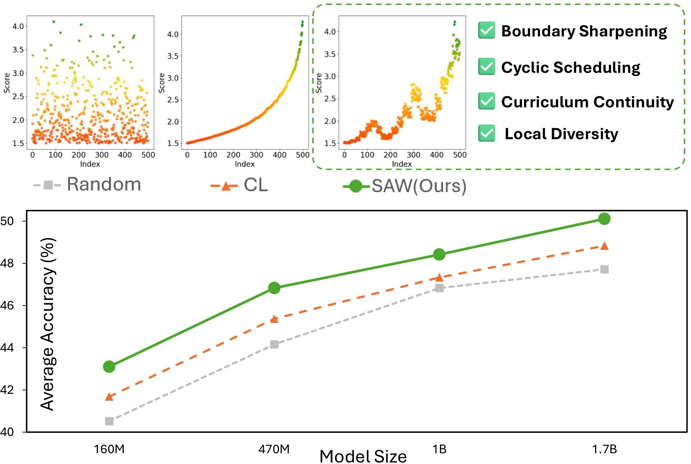
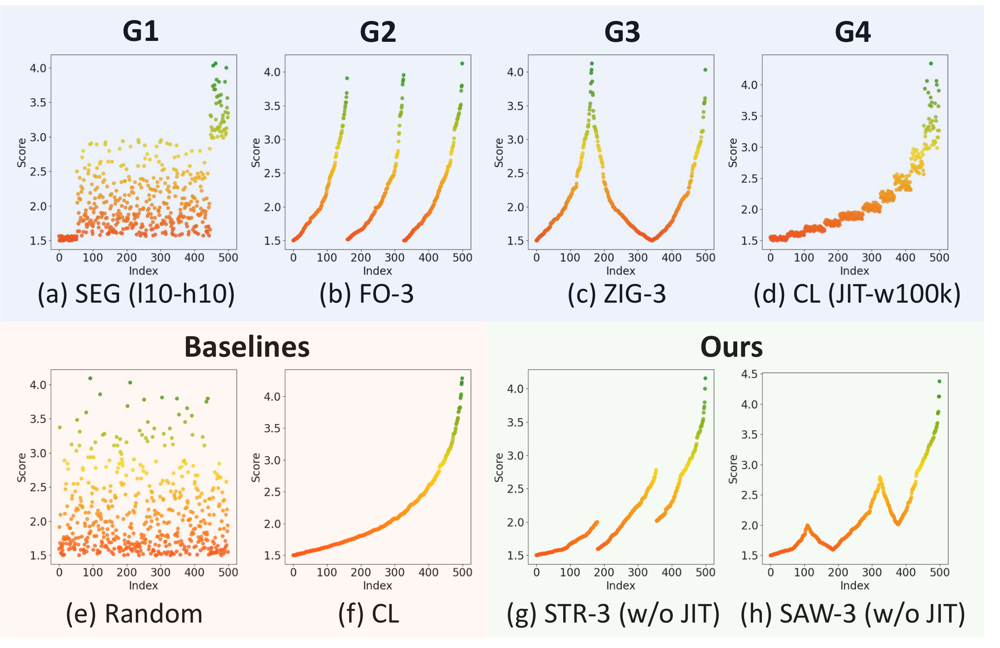
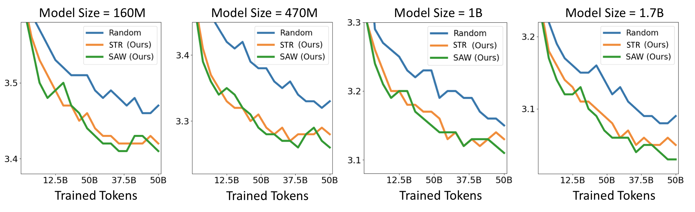

# Demystifying Data Organization for Enhanced LLM Training

This page documents the ACL 2026 follow-up work **"Demystifying Data Organization for Enhanced LLM Training"**. The code is implemented as an extension of DELT's **Data Ordering** stage, so it can reuse the same scored or selected JSONL data produced by the original DELT pipeline.

<!--  -->

## Overview

DELT shows that pre-computed sample-level scores can guide data selection and ordering. This follow-up focuses on a narrower question: once each sample already has a score, how should the training data be organized?

The paper identifies four guidances for data organization:

- **Boundary Sharpening**: control the score distribution at the beginning and end of training.
- **Cyclic Scheduling**: periodically revisit data across the score spectrum during one-pass training.
- **Curriculum Continuity**: avoid abrupt score jumps that can shock the optimizer.
- **Local Diversity**: keep enough heterogeneity in local windows or mini-batches.

The implementation in this folder adds ordering strategies that instantiate these guidances while keeping the input and output format compatible with DELT.

## Methods

Supported ordering methods:

- `shuffle`: random ordering baseline.
- `sorting`: score sorting / curriculum learning baseline.
- `folding`: Folding Ordering (FO), inherited from DELT.
- `zigzag`: Zig-zag Ordering (ZIG), which reverses odd FO layers to improve curriculum continuity.
- `segment`: Segment Ordering (SEG), used for boundary sharpening.
- `stair`: Stair Ordering (STR), which applies FO in local transition regions.
- `saw`: Saw Ordering (SAW), which applies ZIG in local transition regions.

Set `window_size > 1` in any method config to apply Jittering Ordering (JIT), which shuffles samples inside local windows while preserving the global trend.



## Data Format

The input is a JSONL file. Each row must contain the configured score field, whose default name is `average_test_score`.

```json
{"text": "sample text", "average_test_score": 3.7}
{"text": "another sample", "average_test_score": 1.2}
```

The output is another JSONL file with the same records in a new order. The ordering scripts do not change the dataset size or sample content.

## Usage

Run SAW:

```bash
bash data_ordering/entry.sh \
  data/scored_data.jsonl \
  data/ordered_saw.jsonl \
  saw \
  data_ordering/config/saw.yaml
```

Run STR:

```bash
bash data_ordering/entry.sh \
  data/scored_data.jsonl \
  data/ordered_stair.jsonl \
  stair \
  data_ordering/config/stair.yaml
```

Run a baseline:

```bash
bash data_ordering/entry.sh \
  data/scored_data.jsonl \
  data/ordered_folding.jsonl \
  folding \
  data_ordering/config/folding.yaml
```

Equivalent Python entry:

```bash
python3 data_ordering/entry.py \
  --input_data_path data/scored_data.jsonl \
  --output_data_path data/ordered_saw.jsonl \
  --method saw \
  --config_path data_ordering/config/saw.yaml
```

## Configuration

Configs are stored in [config](./config).

Common fields:

- `score_field`: JSONL field containing the sample score.
- `ascending`: whether lower-score samples appear earlier before method-specific reordering.
- `seed`: random seed for shuffle and JIT.
- `window_size`: local JIT window. Set `0` to disable JIT.

Method-specific fields:

- `folding_layer`: number of FO layers for `folding`, `stair`, and `saw`.
- `zigzag_layer`: number of ZIG layers for `zigzag`.
- `num_sections`: number of global sections for STR/SAW.
- `folding_ratio`: transition-region radius as a fraction of the dataset size for STR/SAW.
- `x_pct`, `y_pct`, `front_is_high`, `back_is_high`: boundary settings for SEG.

## Scaling Results

STR and SAW are designed to preserve the benefits of score-based curricula while improving stability and diversity. In the paper, they consistently improve language modeling loss over random ordering across model scales.



## Citation

```bibtex
@inproceedings{dai2026demystifying,
  title={Demystifying Data Organization for Enhanced LLM Training},
  author={Yalun Dai and Yangyu Huang and Tongshen Yang and Yonghan Wang and Xin Zhang and Wenshan Wu and Qihao Zhao and Hao Li and Yuanyuan Gao and Kim-Hui Yap and Scarlett Li},
  booktitle={Proceedings of the Annual Meeting of the Association for Computational Linguistics},
  year={2026}
}
```
